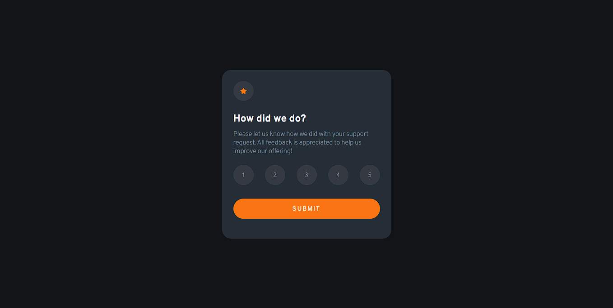

# Frontend Mentor - Interactive rating component solution

This is a solution to the [Interactive rating component challenge on Frontend Mentor](https://www.frontendmentor.io/challenges/interactive-rating-component-koxpeBUmI). Frontend Mentor challenges help you improve your coding skills by building realistic projects. 

## Table of contents

- [Overview](#overview)
  - [The challenge](#the-challenge)
  - [Screenshot](#screenshot)
  - [Links](#links)
- [My process](#my-process)
  - [Built with](#built-with)
  - [What I learned](#what-i-learned)
- [Author](#Author)

## Overview

### The challenge

Users should be able to:

- View the optimal layout for the app depending on their device's screen size
- See hover states for all interactive elements on the page
- Select and submit a number rating
- See the "Thank you" card state after submitting a rating

### Screenshot




### Links

- Solution URL: [@Vit29](https://www.frontendmentor.io/solutions/interactive-rating-component-with-an-animation-to-switch-between-cards-AlhVoL73Jo)


## My process

### Built with

- CSS custom properties
- Flexbox
- Mobile-first workflow


### What I learned

"I put into practice ways to write my HTML code faster with tools like Emmet, which allows me to nest elements."

```html
<!-- div.container-buttoms>button*5.button-rating{$} -->
<div class="container-buttoms">
  <button class="button-rating">1</button>
  <button class="button-rating">2</button>
  <button class="button-rating">3</button>
  <button class="button-rating">4</button>
  <button class="button-rating">5</button>
</div>
  ```

"In CSS, I created a simple yet attractive animation to switch between cards, complemented by JavaScript for proper execution. I added the 'position: absolute' and 'position: relative' properties to the element to change its initial position from card two to the final position of card one. I finished with the 'transition: 500ms ease' property to define the time and animation style."

```css
.container-card-how {
  /* width: 100%;
  height: 100%;
  border-radius: 20px;
  padding: 25px;
  background-color: var(--Dark-Blue); */
  position: absolute;
  right: 0;
  transition: 500ms ease;
}

.hidden-how {
  right: 500px;
  opacity: 0;
}

.container-tankyou {
  /* display: flex;
  flex-direction: column;
  align-items: center;
  justify-content: space-around;
  text-align: center; */
  position: absolute;
  right: 500px;
  opacity: 0;
}

.show-tankyou {
  right: 0;
  opacity: 100%;
}
```

"In JavaScript, I learned to call the event (e) to be able to obtain the user's choice and update it in the DOM, adding a condition to prevent the user from switching cards without having made a choice."

```js

buttomsContainer.addEventListener('click', (e) => {
    let number = e.target.innerText
    resultRating.innerText = number
    if (number >= 1 || number <= 5 ) {
        buttonRating.addEventListener('click', () => {
            containerCard.classList.add('hidden-how')
            containerTankyou.classList.add('show-tankyou')
        })
    }
})
```

## Author

- Website - [Vitaly Varela](https://vit29.github.io/portafolio/)
- Frontend Mentor - [@Vit29](https://www.frontendmentor.io/profile/Vit29)

